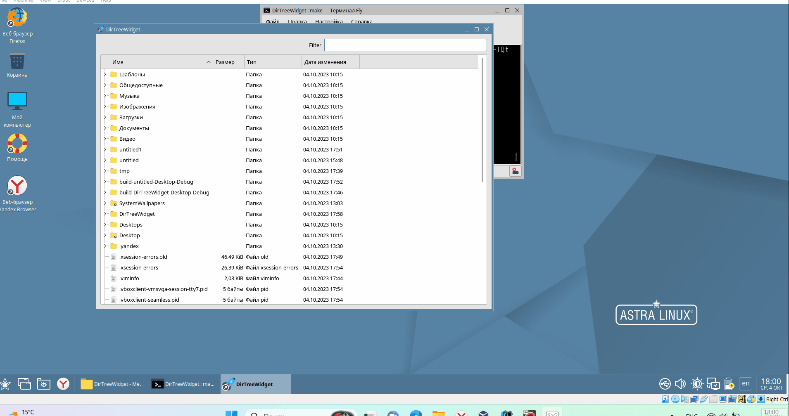

# DirTreeWidget
DirTreeWidget реализация виджета для отображения дерева файловой системы начиная с папки пользователя. Также реализовна фильтрация по имени.

Для сборки используйте make install, запуск make run, для запуска и сборки make/make all.
Для использования сборки через cmake нужно изменить переменную BUILDER в мейкфайл на cmake.
```
    BUILDER := cmake
```
### Пример использования

